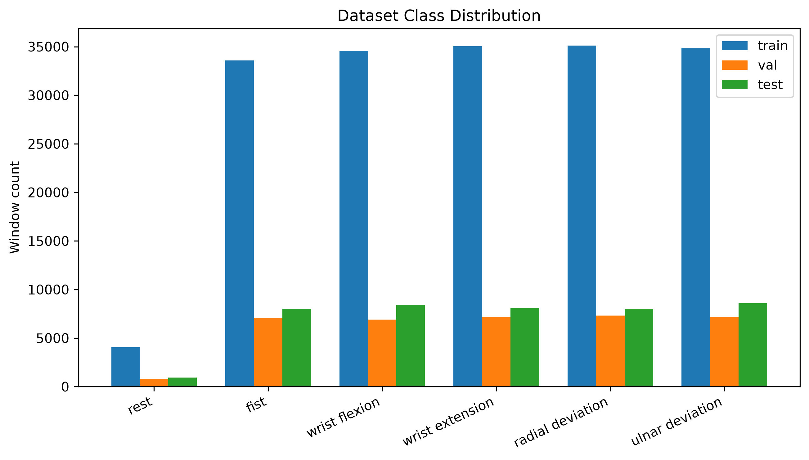
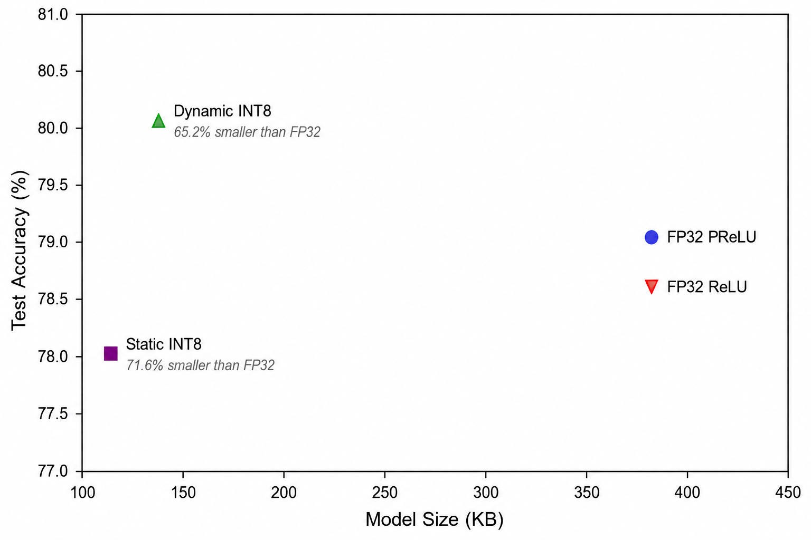
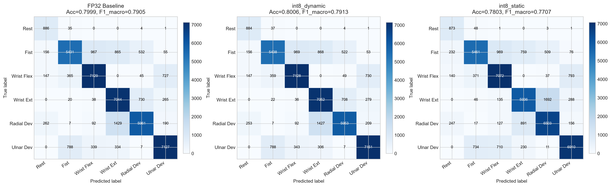

# EMG Gesture Classification for Low-Resource Microcontrollers

This repository contains the code used for the experiments presented in:

**"EMG Gesture Classifiers Toward Deployment on Low-Resource Microcontrollers: A Compact CNN and Post-Training INT8 Quantization Study"**

Author: Mohammed Seada
## Overview

This project explores how far a convolutional neural network (CNN) for EMG gesture classification can be compressed, in parameter count and lower numerical precision, while remaining accurate enough to be useful.


## Setup

```bash
git clone https://github.com/MohamedSeada0/emg-gesture-classification-mcu.git
cd emg-gesture-classification-mcu
pip install -r requirements.txt
```

Requires Python 3.9+.

## Dataset

Experiments use the public **UCI "EMG Data for Gestures"** dataset (36 subjects, 8-channel Myo Thalmic bracelet, 200 Hz):

🔗 https://archive.ics.uci.edu/dataset/481/emg+data+for+gestures

The raw dataset is **not included** in this repository due to its size. Download it and place the extracted folder as `EMG_data_for_gestures-master/` at the project root (same level as `code/`), matching the path expected by `code/uci_data_loader.py`.

## How to Reproduce the Results

Run all commands from inside the `code/` directory.

**1. Build the processed dataset** (subject-wise split, windowing, normalization):
```bash
python uci_data_loader.py
```
This creates `processed_uci_data.pkl` at the project root and prints window counts and class distribution per split.

**2. Train the FP32 baselines:**
```bash
python train_uci.py            # PReLU baseline 
python train_uci_relu.py        #  ReLU baseline
```

**3. Check training stability across random seeds** (optional but recommended):
```bash
python train_uci_seeds.py --seed 123
python train_uci_seeds.py --seed 7
```
Results are appended to `results/seed_results.txt`.

**4. Apply post-training INT8 quantization:**
```bash
python quantize_int8.py         # Dynamic INT8 (PReLU model) + static INT8 
python quantize_int8_v2.py      # Static INT8 built from the ReLU baseline 
```

**5. Generate evaluation reports:**
```bash
python dataset_stats.py             # results/dataset_stats.txt
python classification_report.py     # results/classification_report.txt
```

**6. Generate all figures:**
```bash
python generate_plots.py
python generate_paper_plots.py
```
Figures are saved to `results/figures/`.

## Results

### Dataset

25 subjects for training, 5 for validation, 6 for test, split by subject identity (no leakage across splits).



### Accuracy, Size, and Memory Trade-off

| Model | Quantization | Test Accuracy | Model Size (KB) | Size Reduction vs. FP32 | Peak Activation Memory (KB) |
|---|---|---:|---:|---:|---:|
| FP32 baseline, ReLU (matched) | — | 78.61% | 392.75 | — | 354.62 |
| INT8 dynamic | FC layers only | 80.06% | 136.60 | 65.2% | 355.02 |
| INT8 static (ReLU variant) | Full network | 78.03% | 111.60 | 71.6% | 41.02 |





### Per-Class Performance



Full per-class precision/recall/F1 is available in `results/classification_report.txt`.

